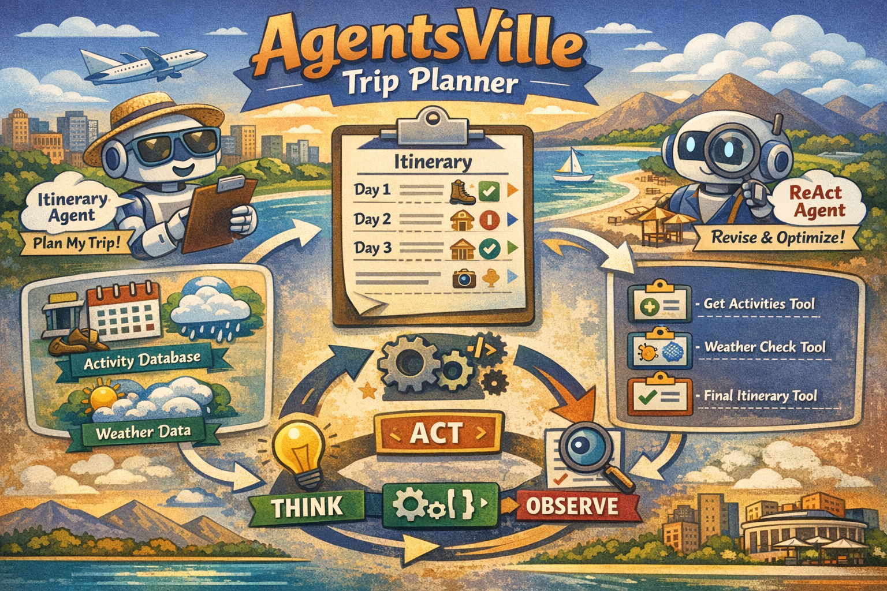

# AgentsVille Trip Planner

This repository contains the AgentsVille Trip Planner Jupyter notebook and supporting code. The app generates and refines travel itineraries using an LLM and simulated tools (weather and activities).

## Getting Started

### 1 Setup 
1. Create and activate a virtual environment:
   - macOS / Linux
     ```bash
     python3 -m venv .venv
     source .venv/bin/activate
     ```
   - Windows (PowerShell)
     ```powershell
     python -m venv .venv
     .\.venv\Scripts\Activate.ps1
     ```

2. Install dependencies:
```bash
pip install -r requirements.txt
```

### Set API keys

```
OPENAI_API_KEY=sk-...
# If using Vocareum:
# VOC_API_BASE=https://openai.vocareum.com/v1
# VOC_API_KEY=voc-...
```

### How to run the agent

```
python app.py
# or
python3 app.py
```

### How to run tests
```
# ensure venv active and package installed in editable mode
pytest -q
```

### Conclusion

- Prompt Engineering: Clear role definitions, structured output requirements, and Chain-of-Thought guidance
- ReAct Agent Design: Proper THINK-ACT-OBSERVE cycle with explicit tool invocation format
- Structured Output: Pydantic models for type validation and schema generation
- Tool Design: Well-documented tool docstrings with parameter specifications

### Learning Resources

- [Prompt Engineering Guide](https://www.promptingguide.ai/) - Comprehensive prompt engineering techniques
- [ReAct: Synergizing Reasoning and Acting](https://arxiv.org/abs/2210.03629) - Original ReAct paper
- [Pydantic Documentation](https://docs.pydantic.dev/latest/) - Structured output with Pydantic
- [OpenAI Function Calling](https://platform.openai.com/docs/guides/function-calling) - Tool use patterns